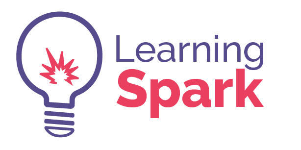

# learning-spark

LearningSpark's goal is to facilitate the education of all students in science, technology, engineering, and math via high quality lessons delivered in our custom boxes.

The LearningSpark Box will enable students in every classroom to engage with STEM topics. The box contains all of the materials and lesson plans necessary to teach students important science, technology, and engineering topics. It will enable underprivileged schools to provide students with access to world-class experiments and demonstrations linked to improving student test scores.

[View the Website](http://lrnsprk.co)

Thanks to html5up-story for the template.